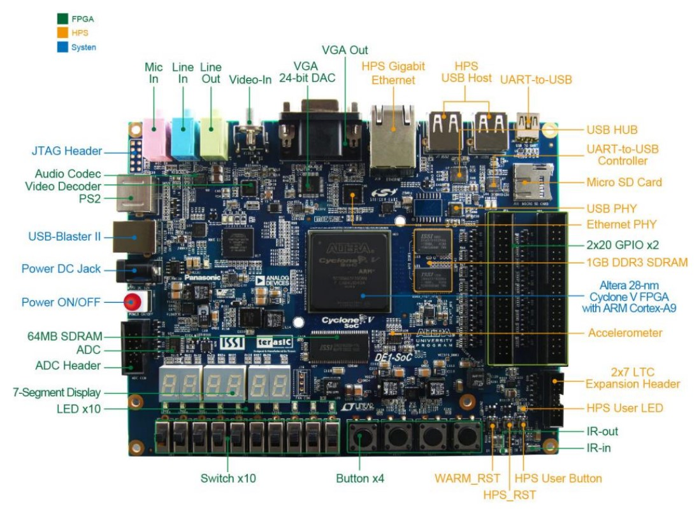
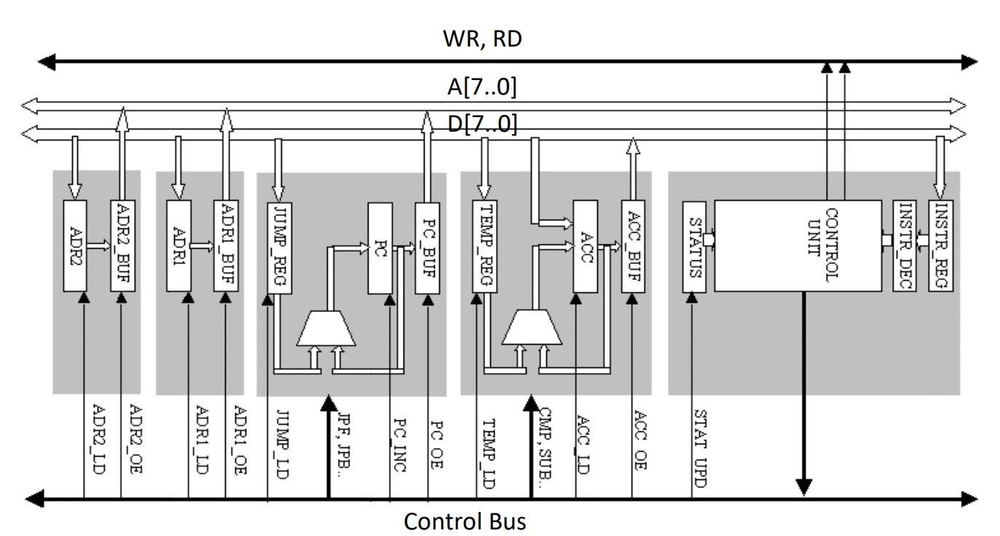

# 8-bit microcontroller in FPGA

## Description
In this project I designed an 8-bit microcontroller in the Altera DE1 SoC FPGA board (see figure below).

The microcontroller with its pheripherals and registers are displayed below.

