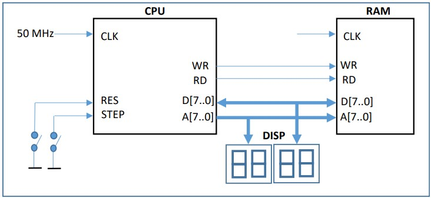
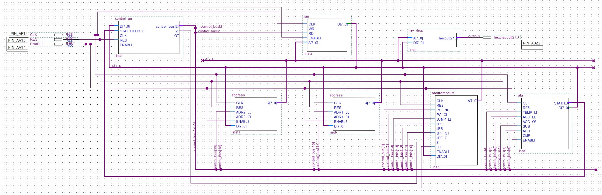

# 8-bit microcontroller in FPGA

## Description
In this project, I designed an 8-bit microcontroller in the Altera DE1 SoC FPGA board (see figure below).

The microcontroller with its main components, peripherals, and registers are displayed in the two figures below.

With the software Quartus Prime, each system component was built with its .vhd file. The final system's block diagram can be seen below.

